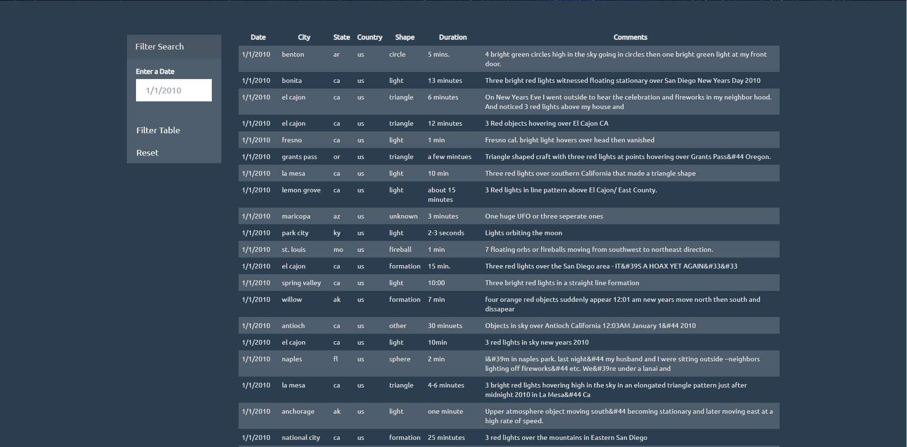

# **JavaScript Challenge - JavaScript and DOM Manipulation**

## Background
For this assignment, write code that will create a table dynamically based upon a [dataset we provide](static/js/data.js). We also need to allow our users to filter the table data for specific values. Languages for this assignment are: JavaScript, HTML, and CSS, and D3.js.

### Level 1: Automatic Table and Date Search (Required)

Create a basic HTML web page or use the index.html file provided (we recommend building your own custom page!). Using the UFO dataset provided in the form of an array of JavaScript objects, write code that appends a table to your web page and then adds new rows of data for each UFO sighting. Make sure you have a column for `date/time`, `city`, `state`, `country`, `shape`, and `comment` at the very least. Use a date form in your HTML document and write JavaScript code that will listen for events and search through the `date/time` column to find rows that match user input.

* **Screen Shot of Level 1: Main Page with Full Dataset** 

* **Screen Shot of Level 1: Data Filter by Date (1/12/2010)**

### Level 2: Multiple Search Categories (Optional)

Complete all of Level 1 criteria. Using multiple `input` tags and/or select dropdowns, write JavaScript code so the user can to set multiple filters and search for UFO sightings using the following criteria based on the table columns:

  1. `date/time`
  2. `city`
  3. `state`
  4. `country`
  5. `shape`
  
* **Screen Shot of Level 2: Full Dataset with Multiple Filter Options** 

* **Screen Shot of Level 2: Subset of Data by Single Filter ("state": "ca")**

* **Screen Shot of Level 2: Subset of Data by Multiple Filters ("city": "san diego", "state": "ca", "country": "us")**

### Technologies used for the assignment:
* HTML 
* CSS
* JavaScript
* D3.js

